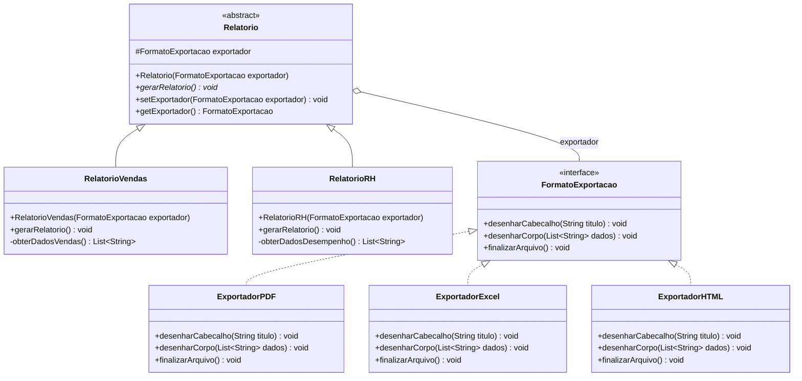
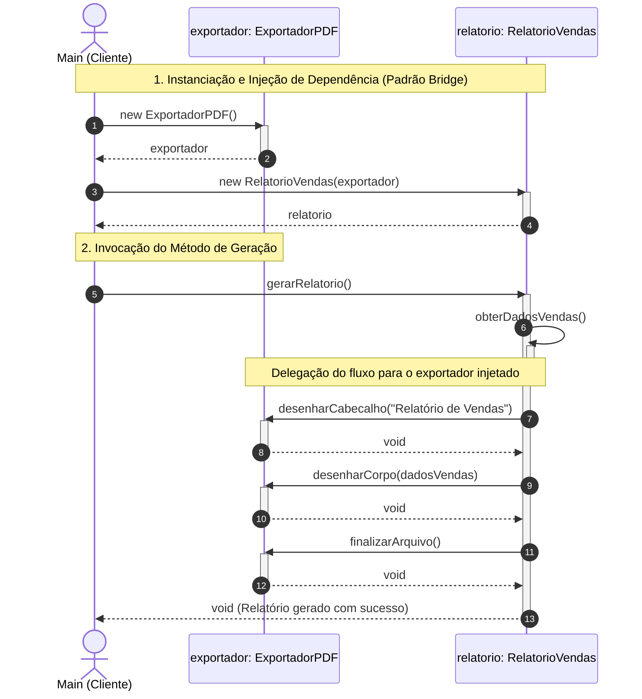

# TechFatec — Sistema de Relatórios Corporativos (Padrão Bridge)

> **Disciplina:** Modelagem de Projetos  
> **Tema:** Padrão Estrutural Bridge (GoF) & Princípio Aberto/Fechado (OCP - SOLID)  
> **Fases:** Fase 1 (Modelagem Estrutural e Comportamental) & Fase 2 (Implementação Profissional em Java)

---

## 1. Contexto do Problema e Justificativa Arquitetural

A equipe de engenharia do sistema de inteligência de negócios **TechFatec** precisava expandir seu módulo de relatórios corporativos:
- **Cenário Legado:** O sistema gerava exclusivamente o `Relatório de Vendas` no formato `PDF`.
- **Novo Requisito:** Inclusão do `Relatório de Desempenho de RH` e garantia de que todos os relatórios (atuais e futuros) possam ser exportados para **PDF**, **Excel (XLSX)** e **HTML**.

### O Problema da Explosão de Subclasses
Em uma modelagem tradicional baseada estritamente em herança, cada variação de formato combinada a cada tipo de relatório demandaria uma classe concreta dedicada:
- `RelatorioVendasPDF`, `RelatorioVendasExcel`, `RelatorioVendasHTML`
- `RelatorioRHPDF`, `RelatorioRHExcel`, `RelatorioRHHTML`

Para $N$ tipos de relatórios e $M$ formatos de saída, a arquitetura cresceria exponencialmente a uma taxa de **$N \times M$ subclasses**. Qualquer novo formato (ex.: CSV, JSON) forçaria a criação de novas classes para todos os relatórios existentes, gerando alto acoplamento e violando o Princípio de Responsabilidade Única (SRP) e o Princípio Aberto/Fechado (OCP).

### A Solução com o Padrão Bridge (GoF)
O padrão **Bridge** separa a **Abstração** (o domínio de negócio: tipos de relatório) da sua **Implementação** (tecnologia de renderização e saída: formatos de arquivo), permitindo que ambas as hierarquias evoluam e variem de forma totalmente independente:
- **Crescimento Linear:** apenas **$N + M$** classes em vez de $N \times M$.
- **Princípio Aberto/Fechado (OCP - SOLID):** novos relatórios são criados sem alterar nenhum exportador existente; novos formatos de exportação são adicionados sem alterar nenhuma linha dos relatórios de negócio.
- **Injeção de Dependência:** o exportador concreto é injetado via construtor (ou alterado dinamicamente via setter), sendo terminantemente proibido o uso do operador `new` dentro das abstrações para instanciar exportadores.

---

## 2. Diagrama de Classes (Modelagem Estrutural)

O diagrama a seguir descreve a separação física e lógica entre a hierarquia de **Abstração** e a hierarquia de **Implementação**:



### Detalhamento dos Componentes

#### 1. Lado da Abstração (`/src/abstracao/`)
- **`Relatorio` (Classe Abstrata):**  
  Define a abstração base da ponte. Contém o atributo protegido `protected FormatoExportacao exportador;`, recebe a implementação via construtor (Injeção de Dependência) e disponibiliza o método `setExportador(...)` para troca dinâmica de formato em tempo de execução.
- **`RelatorioVendas` (Abstração Refinada):**  
  Representa o relatório legado estendido. É responsável pelas regras de negócio de faturamento e consolidação de vendas (`obterDadosVendas()`). Delega a saída para a ponte `exportador`.
- **`RelatorioRH` (Abstração Refinada):**  
  Representa a nova demanda do sistema. Encapsula os indicadores de desempenho, avaliações e clima organizacional dos colaboradores (`obterDadosDesempenho()`). Delega a saída para a ponte `exportador`.

#### 2. Lado da Implementação (`/src/implementacao/`)
- **`FormatoExportacao` (Interface Implementor):**  
  Contrato que define as operações primitivas de renderização que qualquer tecnologia de saída deve implementar:
  - `desenharCabecalho(String titulo)`
  - `desenharCorpo(List<String> dados)`
  - `finalizarArquivo()`
- **`ExportadorPDF` (Concrete Implementor):**  
  Implementa a renderização vetorial, metadados e fechamento de fluxo característicos do padrão PDF.
- **`ExportadorExcel` (Concrete Implementor):**  
  Implementa a formatação em planilhas tabulares, linhas, colunas e pacote OpenXML (XLSX).
- **`ExportadorHTML` (Concrete Implementor):**  
  Implementa a estrutura semântica em HTML5 (`<table>`, cabeçalhos e estilos CSS embutidos).

---

## 3. Diagrama de Sequência (Modelagem Comportamental)

O fluxo de comunicação e a delegação de chamadas entre o cliente, a abstração e o implementor ocorrem conforme o diagrama:



---

## 4. Arquitetura de Diretórios do Projeto

Seguindo estritamente as diretrizes da Fase 2, o código-fonte foi separado fisicamente por responsabilidades arquiteturais:

```text
Projeto_BRIDGE/
├── src/
│   ├── abstracao/                  # Camada de Abstração do Padrão Bridge
│   │   ├── Relatorio.java          # Classe Abstrata base
│   │   ├── RelatorioVendas.java    # Abstração Refinada de Vendas
│   │   └── RelatorioRH.java        # Abstração Refinada de Desempenho de RH
│   ├── implementacao/              # Camada de Implementação do Padrão Bridge
│   │   ├── FormatoExportacao.java  # Interface Implementor
│   │   ├── ExportadorPDF.java      # Concrete Implementor para PDF
│   │   ├── ExportadorExcel.java    # Concrete Implementor para Excel (XLSX)
│   │   └── ExportadorHTML.java     # Concrete Implementor para HTML5
│   └── cliente/                    # Camada do Cliente / Script de Execução
│       └── Main.java               # Classe de validação com os 3 cenários de teste
├── .gitignore                      # Configuração de arquivos ignorados no Git
└── README.md                       # Documentação técnica e diagramas oficiais
```

---

## 5. Injeção de Dependência e Regras Arquiteturais

1. **Vedação de Acoplamento:** Nenhuma classe do pacote `abstracao` faz uso do operador `new` para instanciar classes de `implementacao`. Elas conhecem exclusivamente a interface `FormatoExportacao`.
2. **Injeção via Construtor:** Todas as subclasses (`RelatorioVendas`, `RelatorioRH`) exigem a passagem obrigatória da dependência em seu construtor:
   ```java
   public RelatorioVendas(FormatoExportacao exportador) {
       super(exportador);
   }
   ```
3. **Flexibilidade em Runtime:** O método `setExportador(FormatoExportacao exportador)` na classe base `Relatorio` permite alterar dinamicamente o formato de exportação sem necessidade de descartar ou recriar a instância do relatório.

---

## 6. Como Compilar e Executar

### Pré-requisitos
- **Java SE Development Kit (JDK)** versão 17 ou superior (testado e validado no OpenJDK 21).

### Compilação
No terminal (PowerShell, Bash ou Prompt de Comando), a partir da raiz do projeto:

```bash
# Compilar todos os pacotes direcionando as classes para o diretório bin/
javac -encoding UTF-8 -d bin src/implementacao/*.java src/abstracao/*.java src/cliente/*.java
```

### Execução do Script de Validação
```bash
# Executar a classe principal do cliente
java -cp bin cliente.Main
```

---

## 7. Saída Esperada no Console (Validação das Rotinas)

O script `cliente.Main` simula exatamente as três rotinas exigidas pela especificação:

```text
================================================================================
       TECHFATEC — SISTEMA DE INTELIGÊNCIA DE NEGÓCIOS (PADRÃO BRIDGE)          
================================================================================

>>> [ROTINA 1] Geração de Relatório de Vendas em PDF
    [Injeção de Dependência]: Instanciando ExportadorPDF fora da abstração.
    Injetando no construtor de RelatorioVendas...

  [PDF] ------------------ CABEÇALHO DO DOCUMENTO ------------------
  [PDF] Título: RELATÓRIO CONSOLIDADO DE VENDAS - TECHFATEC
  [PDF] Metadados: Versão PDF 1.7 | Layout: Retrato A4 | Margem: 20mm
  [PDF] -----------------------------------------------------------
  [PDF] Renderizando blocos de texto e tabelas vetoriais:
  [PDF]   • Região Sul | Produto: Licença Enterprise Cloud | Qtd: 45 | Total: R$ 225.000,00
  [PDF]   • Região Sudeste | Produto: Suporte Especializado 24x7 | Qtd: 120 | Total: R$ 360.000,00
  [PDF]   • Região Nordeste | Produto: Treinamento Corporativo Bridge | Qtd: 15 | Total: R$ 45.000,00
  [PDF]   • Região Centro-Oeste | Produto: Consultoria de Arquitetura | Qtd: 30 | Total: R$ 150.000,00
  [PDF]   • TOTAL GERAL DE VENDAS: R$ 780.000,00 | Status: Meta Trimestral Superada (104%)
  [PDF] Inserindo sumário de páginas, assinatura digital e fechando stream.
  [PDF] >> Arquivo gravado com sucesso: saida_relatorio.pdf

>>> [ROTINA 2] Alteração Dinâmica de Formato em Tempo de Execução (Runtime)
    [Desacoplamento]: O mesmo objeto 'relatorioVendas' tem seu exportador
    substituído por ExportadorExcel via setExportador(...) sem recriar o relatório...

  [EXCEL] -------------- WORKBOOK / PLANILHA (XLSX) --------------
  [EXCEL] Planilha Criada: [ Relatório Consolidado de Vendas - TechFatec ]
  [EXCEL] Faixa A1:E1 Mesclada | Formatação: Negrito, Fundo Azul (#1F4E79), Texto Branco
  [EXCEL] -----------------------------------------------------------
  [EXCEL] Populando linhas e colunas na grade do Excel:
  [EXCEL]   Linha 02 | Região Sul | Produto: Licença Enterprise Cloud | Qtd: 45 | Total: R$ 225.000,00
  [EXCEL]   Linha 03 | Região Sudeste | Produto: Suporte Especializado 24x7 | Qtd: 120 | Total: R$ 360.000,00
  [EXCEL]   Linha 04 | Região Nordeste | Produto: Treinamento Corporativo Bridge | Qtd: 15 | Total: R$ 45.000,00
  [EXCEL]   Linha 05 | Região Centro-Oeste | Produto: Consultoria de Arquitetura | Qtd: 30 | Total: R$ 150.000,00
  [EXCEL]   Linha 06 | TOTAL GERAL DE VENDAS: R$ 780.000,00 | Status: Meta Trimestral Superada (104%)
  [EXCEL] Aplicando auto-ajuste de largura de colunas e compactando pacote OpenXML.
  [EXCEL] >> Planilha salva com sucesso: saida_relatorio.xlsx

>>> [ROTINA 3] Geração de Relatório de RH em HTML
    [Extensibilidade OCP]: Novo tipo de relatório (RH) com novo formato (HTML)
    Injetando FormatoExportacao (ExportadorHTML) no construtor de RelatorioRH...

  [HTML] --------------- DOCUMENTO WEB (HTML5) ---------------
  [HTML] <!DOCTYPE html>
  [HTML] <html lang="pt-BR"><head><meta charset="UTF-8"><title>Relatório de Desempenho de RH - TechFatec</title>
  [HTML] <style>body{font-family:Segoe UI,sans-serif;} table{width:100%;border-collapse:collapse;} th,td{padding:8px;border:1px solid #ddd;}</style>
  [HTML] </head><body><h1>Relatório de Desempenho de RH - TechFatec</h1>
  [HTML] <table><thead><tr><th>Registro / Dados Corporativos</th></tr></thead><tbody>
  [HTML]   <tr><td>Colaborador: Carlos Alberto | Cargo: Arquiteto de Software | Avaliação: 9.7/10 | Status: Excedeu Expectativas</td></tr>
  [HTML]   <tr><td>Colaborador: Beatriz Mendes | Cargo: Engenheira DevOps | Avaliação: 9.4/10 | Status: Excedeu Expectativas</td></tr>
  [HTML]   <tr><td>Colaborador: Mariana Souza | Cargo: Tech Lead Back-end | Avaliação: 9.8/10 | Status: Destaque do Trimestre</td></tr>
  [HTML]   <tr><td>Colaborador: Eduardo Santos | Cargo: Analista de QA Pleno | Avaliação: 8.9/10 | Status: Atingiu Metas</td></tr>
  [HTML]   <tr><td>ÍNDICE DE CLIMA ORGANIZACIONAL: 92% Satisfação | Taxa de Turnover: 1.2% (Excelente)</td></tr>
  [HTML] </tbody></table>
  [HTML] </body></html>
  [HTML] >> Página web gerada com sucesso: saida_relatorio.html

================================================================================
   VALIDAÇÃO CONCLUÍDA COM SUCESSO: TODAS AS ROTINAS EXECUTADAS CORRETAMENTE!   
================================================================================
```