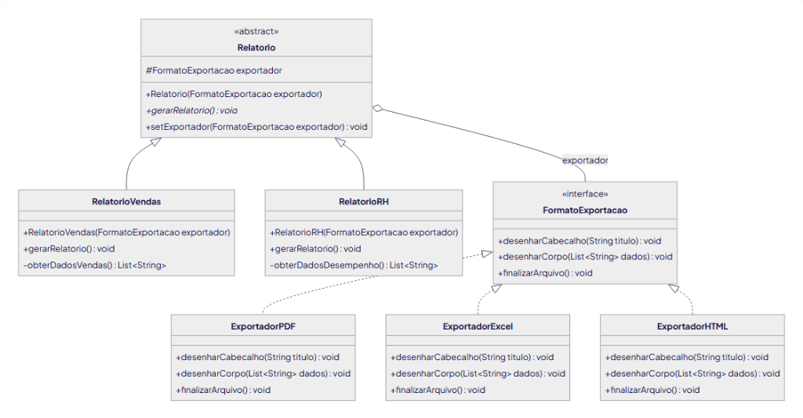
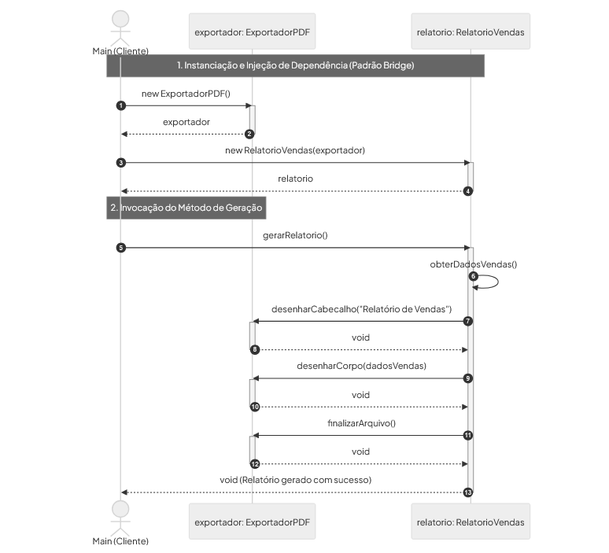

# TechFatec — Sistema de Relatórios Corporativos (Padrão Bridge)

> **Disciplina:** Modelagem de Projetos  
> **Tema:** Padrão Estrutural Bridge (GoF) & Princípio Aberto/Fechado (OCP - SOLID)  
> **Fases:** Fase 1 (Modelagem Estrutural e Comportamental) & Fase 2 (Implementação Profissional em Java)  
> **Integrantes:**  
> - Pablo de Sousa Santos  
> - Pedro Fernandes Araújo  

---

## 1. Contexto do Problema e Justificativa Arquitetural

A equipe de engenharia do sistema de inteligência de negócios **TechFatec** precisava expandir seu módulo de relatórios corporativos:
- **Cenário Legado:** O sistema gerava exclusivamente o `Relatório de Vendas` no formato `PDF`.
- **Novo Requisito:** Inclusão do `Relatório de Desempenho de RH` e garantia de que todos os relatórios (atuais e futuros) possam ser exportados para **PDF**, **Excel (XLSX)** e **HTML**.

### O Problema da Explosão de Subclasses
Em uma modelagem tradicional baseada estritamente em herança, cada variação de formato combinada a cada tipo de relatório demandaria uma classe concreta dedicada:
- `RelatorioVendasPDF`, `RelatorioVendasExcel`, `RelatorioVendasHTML`
- `RelatorioRHPDF`, `RelatorioRHExcel`, `RelatorioRHHTML`

Para $N$ tipos de relatórios e $M$ formatos de saída, a arquitetura cresceria exponencialmente a uma taxa de **$N \times M$ subclasses**. Qualquer novo formato (ex.: CSV, JSON) forçaria a criação de novas classes para todos os relatórios existentes, gerando alto acoplamento e violando o Princípio de Responsabilidade Única (SRP) e o Princípio Aberto/Fechado (OCP).

### A Solução com o Padrão Bridge (GoF)
O padrão **Bridge** separa a **Abstração** (o domínio de negócio: tipos de relatório) da sua **Implementação** (tecnologia de renderização e saída: formatos de arquivo), permitindo que ambas as hierarquias evoluam e variem de forma totalmente independente:
- **Crescimento Linear:** apenas **$N + M$** classes em vez de $N \times M$.
- **Princípio Aberto/Fechado (OCP - SOLID):** novos relatórios são criados sem alterar nenhum exportador existente; novos formatos de exportação são adicionados sem alterar nenhuma linha dos relatórios de negócio.
- **Injeção de Dependência:** o exportador concreto é injetado via construtor (ou alterado dinamicamente via setter), sendo terminantemente proibido o uso do operador `new` dentro das abstrações para instanciar exportadores.

---

## 2. Diagrama de Classes (Modelagem Estrutural)

O diagrama a seguir descreve a separação física e lógica entre a hierarquia de **Abstração** e a hierarquia de **Implementação**:



### Detalhamento dos Componentes

#### 1. Lado da Abstração (`/src/abstracao/`)
- **`Relatorio` (Classe Abstrata):**  
  Define a abstração base da ponte. Contém o atributo protegido `protected FormatoExportacao exportador;`, recebe a implementação via construtor (Injeção de Dependência) e disponibiliza o método `setExportador(...)` para troca dinâmica de formato em tempo de execução.
- **`RelatorioVendas` (Abstração Refinada):**  
  Representa o relatório legado estendido. É responsável pelas regras de negócio de faturamento e consolidação de vendas (`obterDadosVendas()`). Delega a saída para a ponte `exportador`.
- **`RelatorioRH` (Abstração Refinada):**  
  Representa a nova demanda do sistema. Encapsula os indicadores de desempenho, avaliações e clima organizacional dos colaboradores (`obterDadosDesempenho()`). Delega a saída para a ponte `exportador`.

#### 2. Lado da Implementação (`/src/implementacao/`)
- **`FormatoExportacao` (Interface Implementor):**  
  Contrato que define as operações primitivas de renderização que qualquer tecnologia de saída deve implementar:
  - `desenharCabecalho(String titulo)`
  - `desenharCorpo(List<String> dados)`
  - `finalizarArquivo()`
- **`ExportadorPDF` (Concrete Implementor):**  
  Implementa a renderização vetorial, metadados e fechamento de fluxo característicos do padrão PDF.
- **`ExportadorExcel` (Concrete Implementor):**  
  Implementa a formatação em planilhas tabulares, linhas, colunas e pacote OpenXML (XLSX).
- **`ExportadorHTML` (Concrete Implementor):**  
  Implementa a estrutura semântica em HTML5 (`<table>`, cabeçalhos e estilos CSS embutidos).

---

## 3. Diagrama de Sequência (Modelagem Comportamental)

O fluxo de comunicação e a delegação de chamadas entre o cliente, a abstração e o implementor ocorrem conforme o diagrama:



---

## 4. Arquitetura de Diretórios do Projeto

Seguindo estritamente as diretrizes da Fase 2, o código-fonte foi separado fisicamente por responsabilidades arquiteturais:

```text
Projeto_BRIDGE/
├── docs/
│   ├── diagrama_classes.png        # Diagrama de Classes UML
│   └── diagrama_sequencia.png      # Diagrama de Sequência UML
├── src/
│   ├── abstracao/                  # Camada de Abstração do Padrão Bridge
│   │   ├── Relatorio.java          # Classe Abstrata base
│   │   ├── RelatorioVendas.java    # Abstração Refinada de Vendas
│   │   └── RelatorioRH.java        # Abstração Refinada de Desempenho de RH
│   ├── implementacao/              # Camada de Implementação do Padrão Bridge
│   │   ├── FormatoExportacao.java  # Interface Implementor
│   │   ├── ExportadorPDF.java      # Concrete Implementor para PDF
│   │   ├── ExportadorExcel.java    # Concrete Implementor para Excel (XLSX)
│   │   └── ExportadorHTML.java     # Concrete Implementor para HTML5
│   └── cliente/                    # Camada do Cliente / Script de Execução
│       └── Main.java               # Classe de validação com os 3 cenários de teste
├── .gitignore                      # Configuração de arquivos ignorados no Git
└── README.md                       # Documentação técnica e diagramas oficiais
```

---

## 5. Injeção de Dependência e Regras Arquiteturais

1. **Vedação de Acoplamento:** Nenhuma classe do pacote `abstracao` faz uso do operador `new` para instanciar classes de `implementacao`. Elas conhecem exclusivamente a interface `FormatoExportacao`.
2. **Injeção via Construtor:** Todas as subclasses (`RelatorioVendas`, `RelatorioRH`) exigem a passagem obrigatória da dependência em seu construtor:
   ```java
   public RelatorioVendas(FormatoExportacao exportador) {
       super(exportador);
   }
   ```
3. **Flexibilidade em Runtime:** O método `setExportador(FormatoExportacao exportador)` na classe base `Relatorio` permite alterar dinamicamente o formato de exportação sem necessidade de descartar ou recriar a instância do relatório.

---

## 6. Como Compilar e Executar

### Pré-requisitos
- **Java SE Development Kit (JDK)** versão 17 ou superior (testado e validado no OpenJDK 21).

### Compilação
No terminal (PowerShell, Bash ou Prompt de Comando), a partir da raiz do projeto:

```bash
# Compilar todos os pacotes direcionando as classes para o diretório bin/
javac -encoding UTF-8 -d bin src/implementacao/*.java src/abstracao/*.java src/cliente/*.java
```

### Execução do Script de Validação
```bash
# Executar a classe principal do cliente
java -cp bin cliente.Main
```

---

## 7. Saída Esperada no Console (Validação das Rotinas)

O script `cliente.Main` simula exatamente as três rotinas exigidas pela especificação:

```text
=== TechFatec - Módulo de Relatórios ===

1. Gerando Relatório de Vendas em PDF:
[PDF] Cabeçalho: Relatório de Vendas - TechFatec
[PDF] Conteúdo:
  - Região Sul | Enterprise Cloud | Total: R$ 225.000,00
  - Região Sudeste | Suporte 24x7 | Total: R$ 360.000,00
  - Região Nordeste | Treinamento | Total: R$ 45.000,00
  - Região Centro-Oeste | Consultoria | Total: R$ 150.000,00
[PDF] Arquivo gerado com sucesso.

2. Alterando o formato do mesmo relatório para Excel:
[Excel] Planilha: Relatório de Vendas - TechFatec
[Excel] Linhas da planilha:
  Linha 1: Região Sul | Enterprise Cloud | Total: R$ 225.000,00
  Linha 2: Região Sudeste | Suporte 24x7 | Total: R$ 360.000,00
  Linha 3: Região Nordeste | Treinamento | Total: R$ 45.000,00
  Linha 4: Região Centro-Oeste | Consultoria | Total: R$ 150.000,00
[Excel] Planilha gerada com sucesso.

3. Gerando Relatório de RH em HTML:
[HTML] <h1>Relatório de Desempenho de RH - TechFatec</h1>
[HTML] <ul>
  <li>Carlos Alberto (Arquiteto de Software) - Nota: 9.7</li>
  <li>Beatriz Mendes (Engenheira DevOps) - Nota: 9.4</li>
  <li>Mariana Souza (Tech Lead) - Nota: 9.8</li>
  <li>Eduardo Santos (Analista QA) - Nota: 8.9</li>
[HTML] </ul>
[HTML] Documento HTML finalizado com sucesso.
```